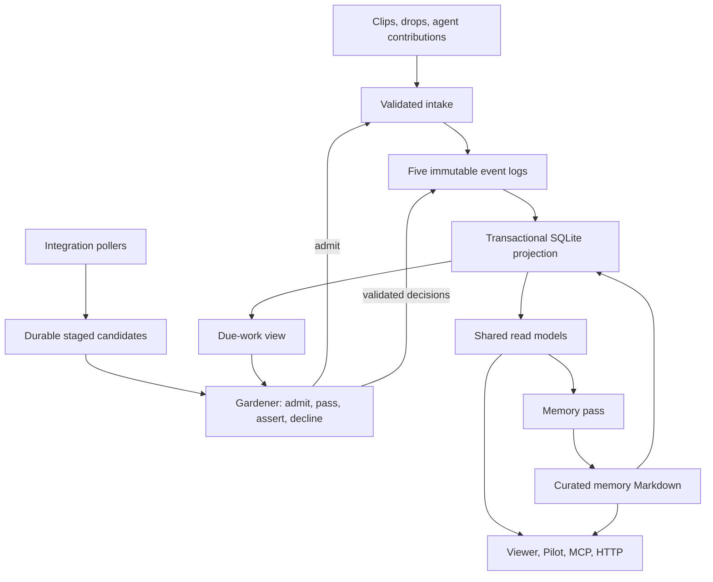

# Architecture

BigBrain is a local application around a separate, code-free vault. Immutable
events preserve what arrived and what was asserted about it. A disposable
SQLite projection makes that record practical to read. Curatorial model jobs
write assertions and a memory working set; the viewer, Pilot, and external
agents use shared operations over that material.

Reviewed against engine `38b78005` on 2026-09-26 (after #993). The
[design principles](design-principles.md) explain why these boundaries exist;
[self-hosting](self-host.md), [providers](pilot-providers.md), and
[agent connections](agent-memory.md) cover operation and setup.

## Processes and entry points

The Tauri desktop shell starts [`bin/desktop.ts`](../bin/desktop.ts), the one
supervisor. It owns the viewer and intake service, schedules tend/publish and
enabled integrations, and stops its children when the app quits. Closing a
window leaves the supervisor running. On wake, overdue jobs get one catch-up
tick. On first run, the supervisor serves setup until a vault is selected.

| Surface | Entry point | Responsibility |
| --- | --- | --- |
| Desktop UI | [`desktop/`](../desktop/README.md), [`web/ui/`](../web/ui/) | Native lifecycle and Svelte interface |
| Viewer HTTP, loopback `:4747` | [`web/server.ts`](../web/server.ts) | UI assets, feed/graph/notes, live updates, settings, explicit local actions and Pilot |
| Authenticated HTTP, loopback `:4748` | [`bin/api.ts`](../bin/api.ts), [`lib/api.ts`](../lib/api.ts) | Token-scoped intake and record access for extensions and integrations |
| Public local MCP, stdio | [`bin/mcp.ts`](../bin/mcp.ts), [`lib/mcp.ts`](../lib/mcp.ts) | `load_memory`, `search_vault`, `read_note`, `drop` |
| CLI and scheduled jobs | [`bin/cli.ts`](../bin/cli.ts), [`bin/tend.ts`](../bin/tend.ts), [`integrations/`](../integrations/) | Explicit commands and bounded background work |

HTTP is both the frontend's transport and a separate integration interface.
The two servers have different authorization contracts: the viewer requires the
session the app creates at each launch (a cookie in the window and in `bigbrain
open`'s browser, a bearer header from local scripts) and has no user accounts;
the integration API checks scopes and token provenance.
Local MCP runs with its launching account's filesystem authority. Current
plugins register that local server; an HTTP token does not grant or revoke MCP
access. Public MCP does not expose internal gardener or memory-writing tools.

Entry points discover the vault. Library functions take `root` explicitly.
[`engine.ts`](../lib/engine.ts) owns engine/vault discovery,
[`manifest.ts`](../lib/manifest.ts) reads `vault.yaml`, and
[`env.ts`](../lib/env.ts) interprets environment settings. Only entry points
import the module that resolves a vault at load time, `vaultRoot.ts`.

## Data flow

### Intake and the record

[`landItem.ts`](../lib/landItem.ts), [`intake.ts`](../lib/intake.ts), and
[`references.ts`](../lib/references.ts) validate and land deliberate saves.
Integrations supply discussable text and source identity; the door can perform
deterministic extraction, such as a PDF text layer, when the client cannot.
Landing needs no curatorial model call. Authenticated doors stamp provenance
from their credential rather than accepting the payload's claimed authority.

Polled candidates can instead enter [`stage.ts`](../lib/stage.ts), which owns
account policy and provider-specific admission. [`stageStorage.ts`](../lib/stageStorage.ts)
owns durable bytes and legacy preservation; [`integrationCursor.ts`](../lib/integrationCursor.ts)
owns tolerant cursor I/O. Neither imports account policy or pollers. Email configuration
parsing stays in `emailConfig.ts`, separate from checkpoint/status handling in `emailState.ts`. Small head
files let the gardener inspect a backlog without decoding every body and
attachment. [`integrationAdmission.ts`](../lib/integrationAdmission.ts) admits
what a managed integration staged, unless the worth gate
([`worthGate.ts`](../lib/worthGate.ts)) passes it. Admission lands the insertion
before removing the pending item; passing persists its audit entry before removal.

[`eventLog.ts`](../lib/eventLog.ts) supplies shared validation, append, read,
month-sharding, and commit machinery. Five event types use it:

| Log | Meaning |
| --- | --- |
| `log/insertions/` | Immutable arrival, envelope, body, provenance and content identity |
| `log/assertions/` | One prose claim with entity links and source references |
| `log/declines/` | A durable decision not to file an arrival |
| `log/revocations/` | Withdrawal or replacement of an assertion |
| `log/entity-aliases/` | Entity identity relationships |

Retries converge on stable event identities; conflicting content cannot replace
an existing event. Corrections append new events. Git commits give the vault
history and an optional publication path; the files remain the event record
even when a later commit or projection step needs retrying.

### Projection and reads

[`assertionProjection.ts`](../lib/assertionProjection.ts) reconciles logs and
allowed Markdown into SQLite under a process-shared write lock. Schema changes
rebuild this disposable database; they do not migrate event files. Reconciliation
publishes content, source presence, thread membership, Markdown metadata, and
parsed links together with a revision. Failure leaves the previous complete
revision intact.

[`vaultReadModel.ts`](../lib/vaultReadModel.ts) is the shared snapshot boundary.
A synchronous `withVaultSnapshot` callback borrows one SQLite read transaction;
nested readers borrow the same transaction. Callers must not hold it across
asynchronous work. Decoded views share a bounded per-vault revision cache.
Local changes trigger reconciliation; a one-second census fallback detects
external changes when notifications are missed.

The feed borrows a narrow `SourceRecord`: source headers, short excerpts, intake
priorities, thread membership, and settlement/supersession facts. Settlement
comes from projected citation and decline IDs, without decoding assertion prose.
The graph's `VaultRecord` reuses those same objects and adds live assertions,
aliases, Markdown metadata, and extracted link evidence. Both belong to the
same revision cache; a feed miss need not hydrate the graph's additional inputs.
Neither decodes every source body. Link targets resolve against current
identities after extraction, so an alias change need not reparse source text.
Full bodies remain available for selected note reads and full-text search.
Persisted feed pages are published only if their input revision is still current.

[`graphCache.ts`](../lib/graphCache.ts) and
[`graphWorker.ts`](../lib/graphWorker.ts) prepare graph/feed data and layouts
away from the viewer's event loop. Graph readers use the same one-second
reconciliation gate as other snapshot readers. An async reader delegates a due
census to a worker; concurrent requests share that preparation. If the revision
is unchanged, the worker returns only its revision and the existing graph is
reused. An obsolete worker can neither publish a graph nor satisfy the shared
freshness clock. The fallback runs on demand, so this adds no idle polling timer.
Layout reuse follows the graph's structure hash; content/evidence follows the
record revision. A graph call inside an existing snapshot borrows that revision.

[`searchCore.ts`](../lib/searchCore.ts) owns search across sources, assertions,
entities, and memory. [`noteResolution.ts`](../lib/noteResolution.ts) resolves
source, entity, thread, session, and Markdown identities. Callers supply access
policy; [`noteRead.ts`](../lib/noteRead.ts) owns the public note payload and path
restrictions. [`noteWindow.ts`](../lib/noteWindow.ts) validates shared HTTP/MCP
window options, and [`vaultRead.ts`](../lib/vaultRead.ts) interprets Markdown
titles and frontmatter. Transport formatting and authorization stay at the
outer boundary.

Some read differences are deliberate. An exact source-file request fails if
that file is missing or damaged; a briefing may use the previously validated
projected copy. Identity, voice, and memory have distinct recovery policies:
identity falls back to strict relevant logs, while voice and memory retain
tolerant raw-log recovery. The latter has filesystem consistency, not a single
SQLite snapshot. A caller should not silently substitute one policy for another.

Provider read/unread flags are another kind of state entirely.
[`sourceReadState.ts`](../lib/sourceReadState.ts) resolves source identities from
the projection, then obtains live state through integration adapters. Refreshes
and writes are serialized, writes set an explicit value and await confirmation,
and all targets are validated before external writes begin. Its TTL describes
provider observations; a vault revision cannot make those observations current.

## Curation and conversation

[`work.ts`](../lib/work.ts) derives due work from unhandled arrivals and exposes
validated submissions. There is no durable intake job queue: an assertion or
decline settles the source. The supervisor schedules
[`tend.ts`](../lib/tend.ts), whose single-flight lock and bounded rounds keep
execution separate from this work view. Staged admission/pass decisions are
available through the same gardener tools.

The gardener uses `read_intake` to continue arrival bodies and inspect prior
assertions. Its character offsets match `next`, including the user-only view
of agent and Pilot conversations. The original transcript remains available
to other readers. Neighborhoods include a truncation flag and next-page offset;
revisions must inspect all prior-claim pages before deciding what to carry
forward. The gardener's `read_note` is for background notes, not arrival bodies.

The `tend/v3` prompt asks for distinct retrieval-useful claims, preserves source
authorship and scope, and prefers directly supported attributed statements.
Candidate assertions require a useful evidence-based inference with uncertainty
in the wording. Prompt changes affect future intake; they do not automatically
re-extract historical assertions.

The memory pass captures its inputs once through
[`memoryInputs.ts`](../lib/memoryInputs.ts), prepares context, and runs with
memory-specific tools. [`memoryRun.ts`](../lib/memoryRun.ts) validates writes,
scope and budget, handles rollback/quarantine, journals the outcome, and commits
only its owned paths. Successful journals retain the IDs actually observed;
backdated events and arrivals during a run remain eligible for a later sweep.
The cached schedule/checkpoint can be recovered from those journals.

Background roles and Quick briefings use the shared
[`ModelRunRequest`](../lib/run/request.ts) contract and
[`runAgent`](../lib/run/agent.ts) dispatch. Embedded Pi runs all app-owned
model work, including Pilot and project workers. Pi owns authentication and the
model/tool loop; the host selects capabilities and enforces output constraints.
Retired native Claude, Codex, and Responses selections normalize at the saved-state
boundary; their private continuations are not resumed. Realtime voice has a
separate audio API contract. External Connected Clients retain their own runtimes
and permissions; connecting one does not authenticate BigBrain model execution.
The shared [`vaultTools.ts`](../lib/vaultTools.ts) handlers are exposed through
different subsets for public MCP, Pilot, and machine jobs.

Pilot is the conversational application above the record:
[`pilotChat.ts`](../lib/pilotChat.ts) owns its lifecycle and persisted application
state, provider sessions own execution, and
[`pilotAccess.ts`](../lib/pilotAccess.ts) mediates command permissions. A Pilot
can read vault evidence and contribute through explicit tools. Background
curation has a smaller tool surface. Quick briefings are cached reading aids;
they do not become assertions. Automatic external chat capture is retired;
saved historical transcripts and Pilot's own ingestion remain supported.

[Project workers](project-workers.md) receive user-approved project scope,
reference folders, exact network destinations, and selected read-only source
accounts. Pi file/command tools run through the OS sandbox; unavailable containment
blocks execution. Pilot cannot grant access. Gardener has no live-account tools.

[`applicationActions.ts`](../lib/applicationActions.ts) owns durable action
identity and receipts across Pilot and direct UI actions. A confirmed duplicate
returns its saved result; an interrupted external effect remains uncertain and
is not replayed. Public application views and revisioned events are separate
from the record's SQLite revision and provider-private transcripts. See
[application actions](application-actions.md) and
[Pilot transitions](pilot-transitions.md).

In the browser, `pilotChatSync.ts` derives wire/view types from public projections
and distinguishes unloaded, loading, failed, and loaded detail. Local text drafts
belong to `pilotDrafts.svelte.ts`. `applicationCoordinator.ts` supplies explicit
navigation and cross-feature commands; navigation and Pilot owners do not import
each other. Vault identity guards request lifetimes independently of process epochs.

Pure record rules stay below reader/writer facades.
[`linkSyntax.ts`](../lib/linkSyntax.ts) owns link parsing, fence masking, and text
rewrites without loading filesystem or record readers; `links.ts` retains
storage-aware validation and maintenance entry points. For example,
[`voiceFacts.ts`](../lib/voiceFacts.ts) and
[`userIdentityPolicy.ts`](../lib/userIdentityPolicy.ts) provide interpretation
without depending on `voice.ts` or `userIdentity.ts`. A dependency test prevents
the shared read model from reaching those facades and recreating import cycles.

## What must survive

| Location | Role and recovery |
| --- | --- |
| `log/` | Authoritative immutable events; preserve and back up |
| `memory/`, other curated Markdown | Current useful content; preserve in git. Memory can be regenerated through model work, not necessarily byte for byte |
| `journal/` | Run attribution, retrieval history, recovery checkpoints and audits; preserve |
| `.blobs/` | Raw attachment payloads; preserve separately from git |
| `.spool/` | Pending integrations, source checkpoints, conversations, worker state and application action receipts; durable local data, generally gitignored |
| `.state/` | Rebuildable projection, caches and ephemeral process state; not the only home of a durable outcome |
| `vault.yaml`, vault `.env` | Configuration and local secrets; `.env` is gitignored |
| Provider/machine stores outside the vault | Login credentials, vault pointer and app settings; separate from the record |

“The logs are the truth” applies to derived record views; it does not mean
everything outside `log/` can be discarded. See the
[backup contract](self-host.md#backup). Deleting caches during a running job is
also different from rebuilding derived state after stopping the engine.

## Where to make a change

- Add an integration at the envelope/staging boundary. Keep provider-specific
  identifiers and credentials in the integration.
- Add a reader through an existing snapshot/query surface. Declare whether it
  needs metadata, selected bodies, or a corpus view; avoid raw-log scans on a
  normal request path.
- Add a transport by adapting shared operations and explicitly selecting
  capabilities. Preserve that transport's authentication and path policy.
- Add model behavior through the shared execution contract and role tools.
  Validate durable writes in host code and journal the result.

Verify against scratch vaults, including replay, failed reconciliation, stale
publication, and concurrent changes. The compact-reader
[measurement report](performance/2026-09-20-compact-readers.md) records output
equivalence, timings, decoding volume, and storage cost. Its
[feed and freshness follow-up](performance/2026-09-20-feed-freshness.md) measures
the narrower snapshot and shared fallback, including the cost of more frequent
reconciliation under active graph traffic. New derived readers should reuse
this boundary and clock instead of adding another cache lifetime.
